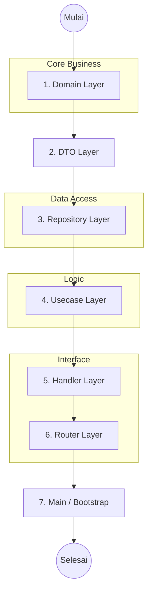

# Workflow Menambah Fitur Baru

Untuk menjaga integritas **Clean Architecture**, penambahan fitur baru harus mengikuti urutan dari layer yang paling dalam (Domain) ke luar (Delivery).

## Alur Kerja (Layer Order)

## Detail Langkah

### 1. Domain Layer (`internal/domain/`)
Tentukan **Entity** (struct) dan **Interface** (kontrak).
- Buat file baru (misal: `product.go`).
- Definisikan struct entity.
- Definisikan `ProductRepository` dan `ProductUsecase` interface.

### 2. DTO Layer (`internal/dto/`)
Tentukan struktur data untuk Request dan Response API.
- Buat file `product_dto.go`.
- Pisahkan data yang diterima dari user (Request) dan dikirim ke user (Response).

### 3. Repository Layer (`internal/repository/postgres/`)
Implementasikan akses ke database.
- Buat `product_repository.go`.
- Implementasikan interface `ProductRepository` menggunakan SQL/Query.

### 4. Usecase Layer (`internal/usecase/`)
Implementasikan logika bisnis.
- Buat `product_usecase.go`.
- Inject `ProductRepository` ke dalam usecase.
- Panggil repository untuk manipulasi data.

### 5. Delivery Layer - Handler (`internal/delivery/http/handler/`)
Buat HTTP handler untuk memproses request.
- Buat `product_handler.go`.
- Inject `ProductUsecase` ke dalam handler.
- Gunakan `internal/dto` untuk parsing request dan formatting response.

### 6. Router (`internal/delivery/http/router.go`)
Daftarkan endpoint API baru.
- Tambahkan grup route baru untuk fitur tersebut (misal: `/products`).

### 7. Main / Bootstrap (`cmd/api/main.go`)
Hubungkan semua komponen (Dependency Injection).
- Inisialisasi Repository → Usecase → Handler.
- Masukkan Handler ke dalam Router.

---

> [!TIP]
> **Selalu mulai dari Domain.** Jika kamu mulai dari Handler, biasanya kamu akan kebingungan menentukan kontrak data dan sering terjadi coupling yang tidak sengaja.
