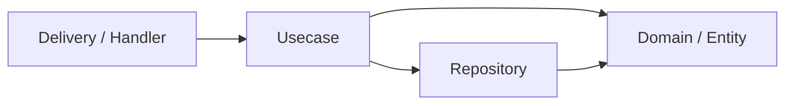

# Warehouse Backend — Clean Architecture REST API (Go + Gin + PostgreSQL)

Backend REST API project dengan arsitektur bersih yang scalable dan siap untuk migrasi ke microservice di masa depan.

## Arsitektur

Menggunakan **Clean Architecture** (Uncle Bob) dengan 4 layer utama:



- **Domain** — Entity dan interface (kontrak). Tidak bergantung pada layer manapun.
- **Usecase** — Business logic. Bergantung hanya pada Domain.
- **Repository** — Implementasi akses data (PostgreSQL). Bergantung pada Domain.
- **Delivery** — HTTP handler (Gin). Bergantung pada Usecase & Domain.

## Folder Structure

```
warehouse_backend/
├── cmd/
│   └── api/
│       └── main.go                    # Entry point aplikasi
│
├── internal/
│   ├── domain/                        # Entity & interface (kontrak)
│   │   ├── user.go                    # User entity + UserRepository & UserUsecase interfaces
│   │   └── errors.go                  # Domain-level custom errors
│   │
│   ├── usecase/                       # Business logic
│   │   └── user_usecase.go
│   │
│   ├── repository/                    # Data access implementations
│   │   └── postgres/
│   │       └── user_repository.go
│   │
│   ├── delivery/                      # HTTP handlers & routing
│   │   └── http/
│   │       ├── handler/
│   │       │   └── user_handler.go
│   │       ├── middleware/
│   │       │   ├── auth.go
│   │       │   ├── cors.go
│   │       │   └── logger.go
│   │       └── router.go             # Route registration
│   │
│   ├── dto/                           # Request / Response structs
│   │   └── user_dto.go
│   │
│   └── infrastructure/                # Shared infra (DB, cache, etc.)
│       ├── database/
│       │   └── postgres.go            # DB connection & migration
│       └── config/
│           └── config.go              # Viper-based config loader
│
├── pkg/                               # Shared packages (bisa dipakai microservice lain)
│   ├── response/
│   │   └── response.go               # Standardized JSON response helper
│   ├── validator/
│   │   └── validator.go              # Custom validator
│   └── logger/
│       └── logger.go                 # Structured logger (zerolog)
│
├── migrations/                        # SQL migration files
│   ├── 000001_create_users_table.up.sql
│   └── 000001_create_users_table.down.sql
│
├── .env.example                       # Environment variable template
├── .gitignore
├── Dockerfile
├── docker-compose.yml
├── Makefile
├── go.mod
└── README.md
```

> [!IMPORTANT]
> **Kenapa struktur ini siap microservice?**
> - `internal/` menjaga kode tetap private per service.
> - `pkg/` berisi shared library yang bisa di-import service lain.
> - `cmd/api/` memungkinkan menambah `cmd/worker/`, `cmd/grpc/` dll sebagai entry point baru.
> - Setiap domain module (`user`, `product`, dll) bisa dipecah jadi service tersendiri karena tidak ada coupling antar module.

## Proposed Changes

### 1. Core Project Files

#### [NEW] [go.mod](file:///c:/Users/Kawe/Documents/Kawe/warehouse_backend/go.mod)
Go module init dengan dependencies: `gin-gonic/gin`, `jackc/pgx/v5`, `spf13/viper`, `rs/zerolog`, `go-playground/validator`.

#### [NEW] [Makefile](file:///c:/Users/Kawe/Documents/Kawe/warehouse_backend/Makefile)
Common commands: `run`, `build`, `migrate-up`, `migrate-down`, `test`, `docker-up`, `docker-down`.

#### [NEW] [.env.example](file:///c:/Users/Kawe/Documents/Kawe/warehouse_backend/.env.example)
Template environment variables (`DB_HOST`, `DB_PORT`, `DB_USER`, `DB_PASSWORD`, `DB_NAME`, `APP_PORT`, `JWT_SECRET`).

#### [NEW] [.gitignore](file:///c:/Users/Kawe/Documents/Kawe/warehouse_backend/.gitignore)

---

### 2. Entry Point

#### [NEW] [main.go](file:///c:/Users/Kawe/Documents/Kawe/warehouse_backend/cmd/api/main.go)
Bootstrap: load config → connect DB → init repo → init usecase → init handler → setup router → start server.

---

### 3. Domain Layer

#### [NEW] [user.go](file:///c:/Users/Kawe/Documents/Kawe/warehouse_backend/internal/domain/user.go)
`User` struct + `UserRepository` interface + `UserUsecase` interface.

#### [NEW] [errors.go](file:///c:/Users/Kawe/Documents/Kawe/warehouse_backend/internal/domain/errors.go)
Custom domain errors: `ErrNotFound`, `ErrConflict`, `ErrUnauthorized`, `ErrBadRequest`.

---

### 4. DTO Layer

#### [NEW] [user_dto.go](file:///c:/Users/Kawe/Documents/Kawe/warehouse_backend/internal/dto/user_dto.go)
`CreateUserRequest`, `UpdateUserRequest`, `UserResponse` — separate dari domain entity.

---

### 5. Usecase Layer

#### [NEW] [user_usecase.go](file:///c:/Users/Kawe/Documents/Kawe/warehouse_backend/internal/usecase/user_usecase.go)
Business logic: create, get by ID, get all, update, delete user. Depends only on `domain.UserRepository`.

---

### 6. Repository Layer

#### [NEW] [user_repository.go](file:///c:/Users/Kawe/Documents/Kawe/warehouse_backend/internal/repository/postgres/user_repository.go)
PostgreSQL implementation of `domain.UserRepository` using `pgxpool`.

---

### 7. Delivery Layer

#### [NEW] [user_handler.go](file:///c:/Users/Kawe/Documents/Kawe/warehouse_backend/internal/delivery/http/handler/user_handler.go)
Gin handlers: `CreateUser`, `GetUserByID`, `GetAllUsers`, `UpdateUser`, `DeleteUser`.

#### [NEW] [router.go](file:///c:/Users/Kawe/Documents/Kawe/warehouse_backend/internal/delivery/http/router.go)
Router setup dengan versioning (`/api/v1/...`) dan middleware registration.

#### [NEW] [auth.go](file:///c:/Users/Kawe/Documents/Kawe/warehouse_backend/internal/delivery/http/middleware/auth.go)
JWT auth middleware (placeholder).

#### [NEW] [cors.go](file:///c:/Users/Kawe/Documents/Kawe/warehouse_backend/internal/delivery/http/middleware/cors.go)
CORS middleware config.

#### [NEW] [logger.go](file:///c:/Users/Kawe/Documents/Kawe/warehouse_backend/internal/delivery/http/middleware/logger.go)
Request logging middleware with zerolog.

---

### 8. Infrastructure

#### [NEW] [postgres.go](file:///c:/Users/Kawe/Documents/Kawe/warehouse_backend/internal/infrastructure/database/postgres.go)
`pgxpool` connection setup + health check + graceful close.

#### [NEW] [config.go](file:///c:/Users/Kawe/Documents/Kawe/warehouse_backend/internal/infrastructure/config/config.go)
Viper config loader: reads from `.env` and environment variables.

---

### 9. Shared Packages (`pkg/`)

#### [NEW] [response.go](file:///c:/Users/Kawe/Documents/Kawe/warehouse_backend/pkg/response/response.go)
Standardized JSON response: `Success()`, `Error()`, `Paginate()`.

#### [NEW] [validator.go](file:///c:/Users/Kawe/Documents/Kawe/warehouse_backend/pkg/validator/validator.go)
Custom validator wrapper (go-playground/validator).

#### [NEW] [logger.go](file:///c:/Users/Kawe/Documents/Kawe/warehouse_backend/pkg/logger/logger.go)
Zerolog-based structured logger.

---

### 10. Migration & Docker

#### [NEW] [000001_create_users_table.up.sql](file:///c:/Users/Kawe/Documents/Kawe/warehouse_backend/migrations/000001_create_users_table.up.sql)
#### [NEW] [000001_create_users_table.down.sql](file:///c:/Users/Kawe/Documents/Kawe/warehouse_backend/migrations/000001_create_users_table.down.sql)
#### [NEW] [Dockerfile](file:///c:/Users/Kawe/Documents/Kawe/warehouse_backend/Dockerfile)
Multi-stage build: build → scratch/alpine.
#### [NEW] [docker-compose.yml](file:///c:/Users/Kawe/Documents/Kawe/warehouse_backend/docker-compose.yml)
Services: `api` + `postgres`.
#### [NEW] [README.md](file:///c:/Users/Kawe/Documents/Kawe/warehouse_backend/README.md)

## Verification Plan

### Automated
1. **Build check**: `go build ./...` — memastikan seluruh kode compile tanpa error.
2. **Vet check**: `go vet ./...` — static analysis.

### Manual
1. Jalankan `docker-compose up -d` untuk start PostgreSQL.
2. Jalankan `go run cmd/api/main.go` dan pastikan server berjalan di port yang dikonfigurasi.
3. Test endpoint `GET /api/v1/health` menggunakan browser atau curl.
